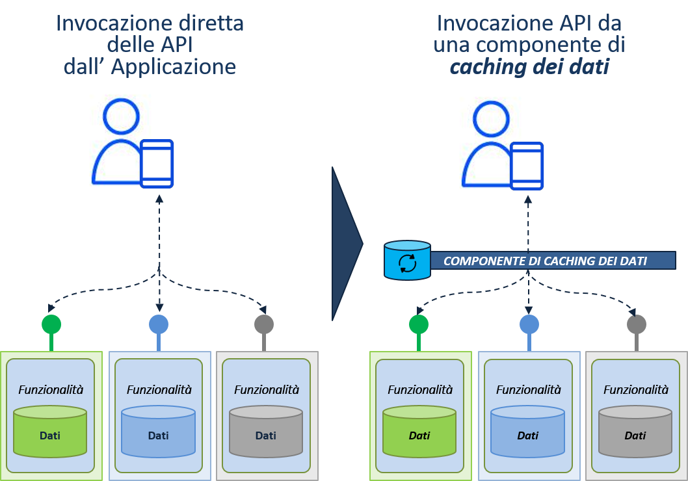

.. _chapter2:

******************************************************************************************************
Dimensioni di qualità per le applicazioni in E015 Digital Ecosystem e Linee Guida per la pubblicazione
******************************************************************************************************

.. raw:: html

  

  

Un’applicazione, per poter essere pubblicata in E015 Digital Ecosystem, deve possedere caratteristiche di qualità che indirizzino sia tematiche di tipo tecnologico – per abilitare la corretta interazione con i servizi pubblicati nell’Ecosistema – che aspetti di tipo organizzativo. Tutti questi elementi sono correlati alle verifiche che saranno svolte dal Technical Management Board per stabilire l’idoneità dell’applicazione stessa alla pubblicazione nell’Ecosistema.
In generale le caratteristiche specifiche di tipo tecnologico rappresentano solo una quota parte delle proprietà di qualità; in una ideale “scala di maturità” di una applicazione verso l’Ecosistema, gli aspetti di tipo tecnologico (per esempio: disponibilità del codice, aspetti infrastrutturali e di architettura, accesso sicuro ai servizi ecc.) sono solo alcune delle proprietà desiderate per un’applicazione;  a queste vanno necessariamente affiancate altre proprietà di qualità  riguardanti gli aspetti di interazione con l’utente e aspetti generali di interazione con l’Ecosistema, che individuano elementi di tipo organizzativo essenziali per assicurare che ciascuna applicazione sia descritta in modo completo e coerente nell’Ecosistema.
Ciascuna delle dimensioni di interesse per la pubblicazione delle applicazioni rappresenta una specifica caratteristica di qualità di un’applicazione, che deve essere realizzata e documentata affinché l’applicazione possa essere considerata pubblicabile all’interno di E015 Digital Ecosystem. 
Le caratteristiche rilevanti per la pubblicazione di una applicazione in E015 Digital Ecosystem sono le seguenti:

* **Aspetti generali di integrazione con E015 Digital Ecosystem** (2.1): rientrano in questa categoria tutti gli aspetti di tipo non tecnico necessari per garantire una corretta gestione organizzativa dell’applicazione all’interno dell’Ecosistema;

* **Aspetti tecnico-funzionali di integrazione con E015 Digital Ecosystem** (2.2): rientrano in questa categoria tutti gli aspetti di tipo tecnico necessari per garantire la corretta integrazione dell’applicazione con le API pubblicate nell’Ecosistema e utilizzate dall’applicazione;

* **Aspetti correlati all’interazione con l’utente finale** come usabilità, grafica, utilizzo (2.3): rientrano in questa categoria tutti gli aspetti correlati all’usabilità dell’applicazione e alla user experience dell’utente finale (ad esempio, la semplicità di installazione e configurazione);in particolare, le Linee Guida di E015 Digital Ecosystem forniscono una linea guida specifica denominata “Smooth degradation of Quality of User Experience” (:ref:`Sezione 2.3.1 <sezione231>`) attraverso la quale si forniscono agli App Provider indicazioni per prendersi in carico eventuali difficoltà di interazione con le API utilizzate dall’applicazione evitando di renderle visibili agli utenti finali.

Nei prossimi paragrafi vengono fornite le indicazioni operative per indirizzare ciascuna di queste caratteristiche di qualità.

.. _sezione21:

Integrazione con Ecosistema (Aspetti Generali)
==============================================

Perché un’applicazione venga pubblicata nell’Ecosistema l’ App Provider deve garantire il rispetto delle seguenti linee guida:

* **Utilizzo del logo «E015 digital ecosystem » nell'applicazione**: L’applicazione deve evidenziare, ove possibile [#f1]_,  nelle proprie schermate, il logo rilasciato in fase di adesione e, ove possibile (nel caso ad esempio di applicazioni interattive) il logo stesso dovrà essere reso cliccabile dall’utente finale referenziando la Home page del sito web dell’Ecosistema. Si consiglia inoltre di indicare in forma testuale l’indicazione “Made in E015”.

.. _sezione22:

Integrazione con Ecosistema (Aspetti Tecnico/Funzionali)
========================================================

In aggiunta alla conformità rispetto alle linee guida generali di integrazione con l’ecosistema descritte nel paragrafo precedente, è necessario che l’applicazione garantisca la *corretta integrazione  con le API pubblicate nell’ecosistema e utilizzate dall’applicazione stessa* sia dal punto di vista della conformità funzionale all’interfaccia presentata dalle API, sia con riferimento al rispetto delle modalità di interazione specifiche previste dalle singole API e definite nei rispettivi descrittori (ad esempio la frequenza massima consentita per l’invocazione dell’API da parte di una applicazione).

In particolare l’App Provider dovrà  indirizzare i seguenti aspetti:

* **Invocazione delle API**: tutte le API dichiarate nella *“Scheda Applicazione”* devono essere correttamente invocate dall’applicazione stessa, secondo le modalità specifiche previste e indicate nei *Descrittori* delle singole API.

* **Architettura dell'applicazione**: al fine di ottimizzare l’utilizzo delle API comuni esposte sull’Ecosistema da parte dell’applicazione è richiesta l’adozione di appositi accorgimenti architetturali interni all’applicazione stessa (quali ad esempio componenti per il caching delle informazioni, l’utilizzo di gateway ecc.).

* **Integrazione con i compenenti 'core' dell'ecosistema**: rientrano in questa categoria tutti gli aspetti tecnologici ed organizzativi a supporto dell’utilizzo dei componenti e meccanismi *'core'*  di E015 Digital Ecosystem  da parte dell’applicazione, quali ad esempio i meccanismi e componenti, già disponibili,  a supporto dell’accesso sicuro alle API da parte delle applicazioni, così come componenti a supporto dell’utilizzo di meccanismi di feedback e rating per applicazioni e API che potranno essere rese disponibili in futuro nell’ecosistema.

.. _sezione221:

Architettura dell'applicazione: caching delle informazione erogate dalle API
-----------------------------------------------------------------------------

L’App Provider nella progettazione e sviluppo dell’applicazione deve adottare gli accorgimenti architetturali interni necessari per garantire l’ottimizzazione delle interazioni con le API comuni dell’Ecosistema utilizzati dall’applicazione stessa.
L’App Provider deve garantire che il numero di richieste trasmesse alle API utilizzate dall’applicazione sia in linea con la frequenza massima di aggiornamento dei dati stabilita dalle singole API (così come specificata dagli API Provider nei rispettivi Descrittori delle API). Per  garantire questo comportamento, l’App Provider deve progettare l’architettura applicativa in modo da evitare che tutte le azioni effettuate sull’interfaccia utente dell’applicazione si traducano automaticamente in richieste sulle API utilizzate dall’applicazione, con il rischio di generare un traffico inutile (se la frequenza delle richieste supera quella massima di aggiornamento da parte dei singoli API Provider) e  potenzialmente dannoso per l’API Provider.

.. _caching:

   Figura 2.1: Processo di pubblicazione di un Applicazione in E015 Digital Ecosystem

L’introduzione nell’architettura dell’applicazione di componenti intermedi in grado di svolgere il ruolo di **mediatori nelle interazioni con i servizi applicativi dell’ecosistema** (:ref:`Figura 2.1 <caching>`), consente di indirizzare in modo adeguato e flessibile il requisito sopra descritto. Questi componenti implementano dei **meccanismi di caching intelligente dei dati restituiti dalle API** dell’ecosistema utilizzate dall’applicazione. 
È importante ricordare che la durata della memorizzazione dei dati di ciascun servizio nella cache dovrà essere necessariamente conforme a quanto eventualmente definito dall’API Provider nelle policy dell’API.

.. _sezione222:

Integrazione con i componenti *‘core’* dell’ecosistema: accesso sicuro alle API e utilizzo del meccanismo dell’attestazione
---------------------------------------------------------------------------------------------------------------------------

L’App Provider deve garantire l’utilizzo dei componenti e meccanismi ‘core’  di E015 Digital Ecosystem  da parte dell’applicazione, quali ad esempio i meccanismi e componenti a supporto dell’accesso sicuro, o componenti a supporto dell’utilizzo di meccanismi di feedback e rating per applicazioni e API che potranno essere resi disponibili in futuro.
In particolare il componente di *supporto alla gestione dell’attestazione di partecipazione all’Ecosistema* è un componente “logico” dell’architettura che rappresenta il supporto al meccanismo di attestazione dell’appartenenza di API e applicazioni all’Ecosistema basato su **certificati X.509** memorizzati e resi disponibili dai registri di E015 Digital Ecosystem.
Tale supporto consiste nel fornire meccanismi che permettano di discriminare l’accesso alle API a diversi livelli, permettendo per esempio all’API provider di decidere a quali applicazioni o API permettere l’accesso applicativo e all’App Provider di indentificare univocamente la propria applicazione nel momento dell’invio delle richieste alle API utilizzate nell’ecosistema.
Il meccanismo di attestazione si basa sulla pubblicazione e sull’utilizzo di certificati X.509 (http://www.itu.int/rec/T-REC-X.509/en) da parte dell’API Provider e dell’App Provider che intendono interagire a fini di mutuo riconoscimento. Tale meccanismo è monitorato dal Technical Management Board dell’Ecosistema.

Segue una descrizione di dettaglio delle attività da svolgere da parte dell’App Provider per la predisposizione e successivo utilizzo del meccanismo di attestazione nelle diverse fasi del processo di pubblicazione dell’applicazione:

* **Fase di invio della richiesta d’uso delle API a E015 Digital Ecosystem**
    * L’App Provider  crea una coppia di chiavi, una privata e una pubblica inserita in un certificato X.509, ottenendola da una authority esterna o auto generandola (si veda più avanti).

    * L’App Provider trasmette il certificato definito per la propria applicazione all’Ecosistema insieme alla richiesta di utilizzo delle API.

* **Fase di sviluppo e dispiegamento dell’applicazione**: L’App Provider  configura il proprio application server per l’utilizzo della chiave privata inserendola nel relativo keystore allo scopo di utilizzarla nelle interazioni su protocollo SSL/TSL con Client Authentication richieste dagli API Provider. In caso di app mobile, realizza un opportuno App Broker per la gestione delle interazioni sicure tra Ecosistema e istanze multiple dell’applicazione installate su dispositivi mobili (tale mediatore rappresenta un elemento di disaccoppiamento tra istanze multiple di una applicazione mobile e il resto dell’Ecosistema, così da ricondurre allo scenario standard e gestire in modo omogeneo le interazioni tra soggetti dell’Ecosistema relative all’attestazione di appartenenza).

* **Fase di preparazione alla fruizione dell’API**
    * L’App Provider recupera il certificato dell’API da fruire dal relativo descrittore pubblicato nel Catalogo delle API di E015 Digital Ecosystem oppure dalla notifica di accettazione della richiesta di utilizzo dell’API trasmessa dall’ecosistema.
    * L’App Provider  inserisce il certificato dell’API nel truststore dell’application server su cui gira l’applicazione (o il proprio Application Broker).

* **Fase di fruizione dell’API a runtime**: L’applicazione instaura un canale di comunicazione sicuro (SSL/TLS con Client Authentication) tra EUApp Broker e API utilizzando lato client la propria chiave privata.

Il Technical Management Board supporta la gestione del meccanismo di attestazione svolgendo le seguenti attività:

* **Durante la fase di gestione delle richieste di utilizzo delle API trasmesse dall’App Provider**:
   * Verifica che il certificato X.509 predisposto per l’applicazione (e che sarà successivamente usato nelle interazioni applicative per attestare l’appartenenza dell’applicazione a E015 Digital Ecosystem) abbia una struttura conforme a quanto previsto dalle linee guida
   * Se il certificato è corretto lo aggiunge all’albo dei certificati di API e applicazioni dell’Ecosistema o lo trasmette agli API Provider unitamente alla richiesta di utilizzo delle API.
* **A regime**:
   * Monitora periodicamente la validità dei certificati pubblicati nei registri dell’Ecosistema e propaga agli App Provider le opportune notifiche  di invito al rinnovo in prossimità delle date di scadenza.

L’ obiettivo dell’Ecosistema in questo scenario di accesso sicuro alle API non è rivestire il ruolo di “certificatore” bensì **gestire l’albo dei certificati di API e applicazioni** per supportare il meccanismo di attestazione basato sul reperimento e mutuo riconoscimento di certificati. Per questo motivo non sono previste componenti software di supporto centralizzate per l’emissione di certificati X.509 che dovranno essere selezionati autonomamente; ciascun referente (di applicazione e API) è responsabile infatti di scegliere il proprio certificato e pubblicarlo nell’Ecosistema per renderlo noto alle altre entità dell’Ecosistema con cui potrà interagire. I certificati utilizzati da applicazioni e API potranno quindi in generale essere emessi da operatori di mercato ampiamente riconosciuti ed acquistati dal referente dell’applicazione oppure potranno essere generati autonomamente dal referente dell’applicazione utilizzando strumenti anche di libero utilizzo disponibili sul mercato. Si precisa infine che l’utilizzo in E015 Digital Ecosystem di certificati auto-generati è consentito al fine di ampliare al massimo la possibilità di inclusione nell’ecosistema di applicazioni e API; la soluzione da preferire comunque dovrebbe essere quella di utilizzo di certificati emessi da operatori professionali di mercato ampiamente riconosciuti.

.. _sezione2221:

Linee guida per la definizione del certificato dell'applicazione
^^^^^^^^^^^^^^^^^^^^^^^^^^^^^^^^^^^^^^^^^^^^^^^^^^^^^^^^^^^^^^^^

* Si richiede per ciascuna applicazione pubblicata nell'ecosistema l'utilizzo di certificati X509 **non self-signed**.
   * Nel caso di certificati non auto-generati (ad es. acquistati da un operatore di mercato o emessi da una authority riconosciuta) questa è la normale prassi, poiché questi certificati non sono mai self-signed ed esiste sempre una CA (quella del fornitore dei certificati) utilizzata per firmare i certificati foglia.
   * Nel caso di certificati auto-generati il requisito si traduce nella necessità di generare prima di tutto un certificato root CA  (Certification Authority) e solo successivamente il certificato foglia finale che sarà effettivamente utilizzato nella connessione con i diversi servizi da parte dell’applicazione.
   * Entrambi i certificati (CA e foglia) dovranno essere trasmessi con la richiesta di utilizzo delle API e successivamente forniti insieme alla scheda applicazione [#f2]_.

* Caratteristiche richieste per il certificato CA e il certificato foglia:
     **Certificato CA**
         * Durata: >=7 anni;
         * Basic Constraint: Certification Authority, non critical;
         * Signature Algorithm: almeno SHA256
     **Certificato foglia**
         * Durata: >=5 anni;
         * Basic Constraint: End Entity (quindi non-CA);
         * Extended Key Usage: TLS Web Server Authentication, TLS Web Client Authentication;
         * Signature Algorithm: almeno SHA256;

.. _sezione23:

Interazione con End User: Linee guida per Usabilità e User Experience
=====================================================================

L’App Provider, nella progettazione e sviluppo dell’applicazione, deve adottare gli accorgimenti architetturali interni necessari per **garantire buone caratteristiche di usabilità** dell’applicazione da parte degli utenti finali, oltre ad **assicurare una buona user experience**.

Con riferimento al tema generale dell’usabilità dell’applicazione da parte degli utenti finali, è importante che siano indirizzate in particolare almeno le seguenti tematiche:

* **Prestazioni dell'applicazione**:
  La percezione dell’utente finale sui tempi di risposta dell’applicazione deve essere di tempi ragionevolmente brevi e comunque accettabili nell’accesso alle diverse funzionalità applicative, in particolare quelle correlate all’interazione con gli API Provider dell’Ecosistema, qualunque sia la tipologia specifica di applicazione (applicazione web, applicazione nativa in esecuzione su un device dell’utente, etc,). Questo potrà richiedere di prevedere, nella progettazione dell’architettura applicativa, meccanismi in grado di nascondere all’utente finale, per quanto possibile, eventuali inefficienze nell’accesso alle API (ad esempio per problemi di rete). In questo ambito potrebbe risultare ancora una volta utile l’utilizzo di componenti  architetturali di mediazione nell’interazione con i servizi dell’Ecosistema già descritti in precedenza (caching delle informazioni restituite dai servizi dell’ecosistema).

* **Installabilità e configurabilità dell’applicazione**:
  Nel caso di applicazioni che richiedono attività di installazione da parte dell’utente finale su dispositivi propri (ad esempio applicazioni per smartphone scaricate da un application store) si richiede che l’attività di installazione e configurazione eventualmente richiesta all’utente finale sia minimale e che possa essere svolta da utenti senza conoscenze tecniche specifiche.

* **Supporto MultiBrowser (solo per applicazioni Web)**
  Si richiede che l’applicazione possa essere eseguita sulle ultime versioni dei principali browser utilizzabili nei diversi ambienti applicativi utilizzabili dagli utenti finali.

Queste caratteristiche sono importanti affinché l’applicazione sia attraente e di facile utilizzo.Qualora non fossero realizzate, non precludono l’accettazione dell’applicazione da parte del TMB; in sede di verifica il TMB potrà esprimere delle raccomandazioni al fine di incentivare l’evoluzione futura delle applicazioni nell’ottica di migliorare nel tempo lecaratteristiche di usabilità (:ref:`Capitolo 3 <capitolo3>`).

.. _sezione231:

Interazione con End User: Smooth Degradation of Quality of User Experience
--------------------------------------------------------------------------

Con riferimento alla user experience dell’applicazione correlate all’interazione con le API dell’ecosistema, si richiede che gli App Provider progettino l’applicazione in modo da garantire il rispetto di una linea guida specifica per l’usabilità denominata *“Smooth degradation of Quality of User Experience”*.

Questa linea guida stabilisce in sostanza che l’applicazione deve implementare *meccanismi in grado di gestire adeguatamente eventuali problemi di non raggiungibilità delle API*, evitando quindi di rendere visibile agli utenti finali l’indisponibilità delle API ma presentando – per esempio – contenuti alternativi in sostituzione delle stesse.

L’attuazione di questo principio richiede che l’applicazione si impegni a fornire una *vista utente ricca e innovativa*,non una semplice visualizzazione diretta dei dati restituiti dagli API Provider. L’applicazione deve essere realizzata con l’obiettivo di indirizzare le reali esigenze degli utenti finali e non deve quindi essere un semplice strumento di presentazione delle informazioni fornite dai servizi con cui questa interagisce.

Inoltre l’applicazione dovrà anche occuparsi di fornire un’ *interfaccia omogenea* agli utenti finali, anche nel caso di interazione dell’applicazione con una pluralità di erogatori di API: questo significa che l’interazione con le singole API dovrà essere presentata agli utenti finali prescindendo dalle eventuali specificità di interazione richieste dalle singole API utilizzate.

.. rubric:: Footnotes

.. [#f1] Alcuni esempi di applicazioni impossibilitate a mostrare il logo rilasciato in fase di adesione sono: pannelli informativi in grado di visualizzare solamente messaggi di tipo testuale, schermi vincolati – anche per motivi di carattere normativo – alla visualizzazione di soli elementi grafici predefiniti non personalizzabili.

.. [#f2] Ciascun API Provider potrà stabilire, sulla base delle specificità dei propri componenti per la gestione delle connessioni SSL, se utilizzare per l’abilitazione di una specifica applicazione direttamente il certificato foglia oppure il certificato CA (aggiungendo poi regole specifiche per abilitare soltanto lo specifico certificato foglia).
